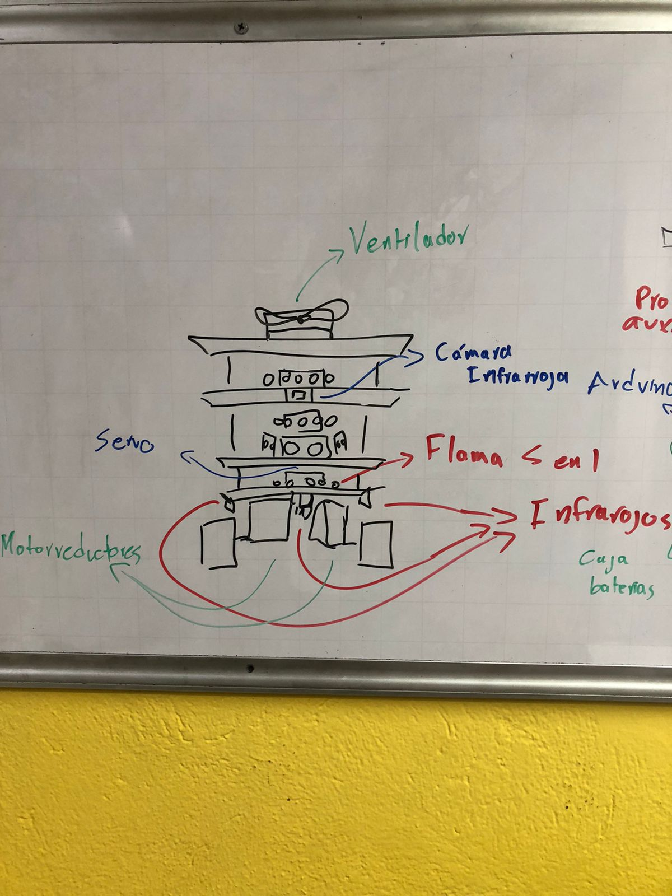

# Robot para competencia de firefighting

## Ideas:

- Ninguna

## Materiales: 

- Camara termica infrarroja AMG8833 
- Sensor de flama 5 en 1 (x3)
- Ruedas oruga
- Sensor ultrasonico (x3) 
- Motor DC de 4000 rpm 
- ServoMotores (x4) 
- Arduino Mega 
- Puente H para motores o integrado L293D 
- 

## Prototipo:

